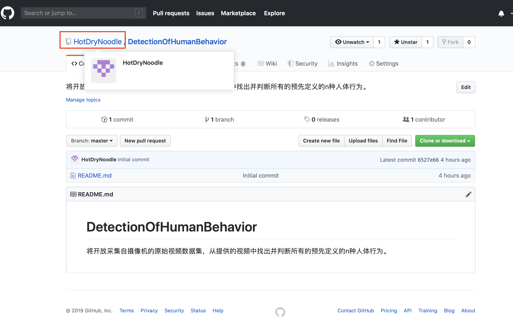

# Git相关
+ [git远程提交代码链接教程](https://blog.csdn.net/wwei25/article/details/53906541)

## Git本地操作
+ **设置基本信息**

```shell
#设置用户名-> github上你的用户名
git config --global user.name '@HotDryNoodle'
#设置用户名邮箱 -> 用于申请github的邮箱
git config --global user.name 'www.ouyangfangxi@163.com'
```

    + 项目的链接为：[人体的行为检测github仓库](https://github.com/HotDryNoodle/DetectionOfHumanBehavior)
+ **初始化**

+ **工作区->暂存区->仓库相关操作**

## Git->github远程操作

在本地的文件夹下利用`git init`命令初始化git仓库后，就可以将github上的项目代码拉下来
+ 首先在**github**上配置好ssh**秘钥**详情可见：(https://segmentfault.com/q/1010000003061640)
+ **git克隆操作**

    代码:(clone 的地址如图所示)**选用ssh**下载
```Shell
git clone ssh://github.com/HotDryNoodle/DetectionOfHumanBehavior.git 
```

+ **git查询指令**
`git config --list`
```Shell
SunnydeMacBook-Pro:DetectionOfHumanBehavior sunnyhotdrynoodle$ git config --list
credential.helper=osxkeychain
user.name=www.ouyangfangxi@163.com
core.repositoryformatversion=0
core.filemode=true
core.bare=false
core.logallrefupdates=true
core.ignorecase=true
core.precomposeunicode=true
remote.origin.url=https://github.com/HotDryNoodle/DetectionOfHumanBehavior.git
remote.origin.fetch=+refs/heads/*:refs/remotes/origin/*
branch.master.remote=origin
branch.master.merge=refs/heads/master
SunnydeMacBook-Pro:DetectionOfHumanBehavior sunnyhotdrynoodle$ 
```
+ git中文文件显示乱码
```shell
git config --global core.quotepath false
```

