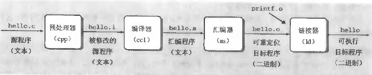

[TOC]
# PYTHON
## **编译型语言与解释型语言**

+ **编译语言：**编译是指在应用源程序执行之前，就将程序源代码“翻译”成目标代码（机器语言），因此其目标程序可以脱离其语言环境独立执行，使用比较方便，效率较高。C、C++、Ada、Pascal都是编译实现的。
+ **解释型语言：**解释型语言的实现中，翻译器并不产生目标机器代码，而是产生易于执行的中间代码。这种中间代码与机器代码是不同的，中间代码的解释是由软件支持的，不能直接使用硬件，软件解释器通常会导致执行效率较低。解释程序的任务是逐一将源程序的语句解释成可执行的机器指令，不需要将源程序翻译成目标代码再执行。解释程序的优点是当语句出现语法错误时，可以立即引起程序员的注意，而程序员在程序开发期间就能进行校正。一般地，动态语言都是解释型的，例如：Tcl、Perl、Ruby、VBScript、JavaScript等。
 
  **python**：解释型语言(先编译后解释)        
  
  ```mermaid
     graph LR
     a[源代码*.py]-->b[二进制字节码*.pyc]
     b[二进制字节码*.pyc]--python解释器-->c[机器码]
  ```    
  ## **类型**
+ **C++**：**静态强类型**语言，类型是C++非常重要的概念，变量必须指定类型，C++编译器需要根据类型来分配内存。
+ **python**：**动态强类型**语言。python依然是强类型语言，因为它有类型概念，且不允许不同类型相加。它跟C++一个重大区别是它是动态语言。它**不需要显式声明类型**，而是在第一次赋值时确定。

## **变量**
+ C++变量代表一块内存，变量可以被取地址，变量的地址就是存储内容的首地址。

+ python的变量更类似指针，或者叫标签。它可以指向任何东西，也可以任意更改指向。变量的地址并不是真正存储内容的地方。

    正是由于python变量的这种特性，它才成为一种动态语言。
    
## **强大的三方库**
+ **pip install + import 搞定一切**
## **语法特性**
+ 简单灵活
+ 动态语言
+ 自动内存管理
+ 跨平台、可移植

    开发效率效率是C++的5~10倍！！
    > python之禅   (pythonic)
优美胜于丑陋（Python 以编写优美的代码为目标）
明了胜于晦涩（优美的代码应当是明了的，命名规范，风格相似）
简洁胜于复杂（优美的代码应当是简洁的，不要有复杂的内部实现）
复杂胜于凌乱（如果复杂不可避免，那代码间也不能有难懂的关系，要保持接口简洁）
扁平胜于嵌套（优美的代码应当是扁平的，不能有太多的嵌套）
间隔胜于紧凑（优美的代码有适当的间隔，不要奢望一行代码解决问题）
**可读性很重要**（优美的代码是可读的）
即便假借特例的实用性之名，也不可违背这些规则（这些规则至高无上）
不要包容所有错误，除非你确定需要这样做（精准地捕获异常，不写 
except:pass 风格的代码）
当存在多种可能，不要尝试去猜测，而是尽量找一种，最好是唯一一种明显的解决方案（如果不确定，就用穷举法）
虽然这并不容易，因为你不是 Python 之父（这里的 Dutch 是指 Guido ）
做也许好过不做，但不假思索就动手还不如不做（动手之前要细思量）
如果你无法向人描述你的方案，那肯定不是一个好方案；反之亦然（方案测评标准）
**命名空间**是一种绝妙的理念，我们应当多加利用（倡导与号召）

## **编程规范**
  + [python风格规范](https://zh-google-styleguide.readthedocs.io/en/latest/google-python-styleguide/python_style_rules/)
  + [python语言规范](https://zh-google-styleguide.readthedocs.io/en/latest/google-python-styleguide/python_language_rules/)
  + [PEP8官方规范](https://blog.csdn.net/ratsniper/article/details/78954852)
  + [廖雪峰网站](https://www.liaoxuefeng.com/wiki/1016959663602400/1017502538658208)
  + [what the fuck python](https://github.com/leisurelicht/wtfpython-cn)


