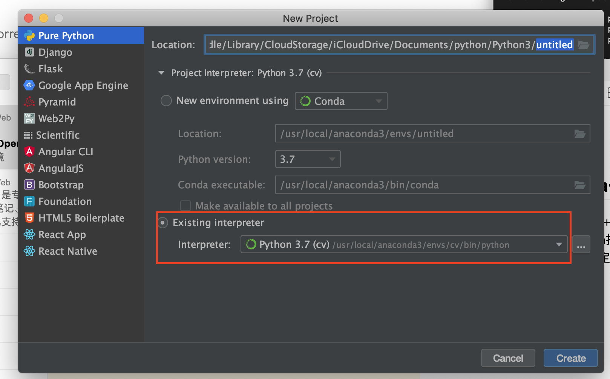
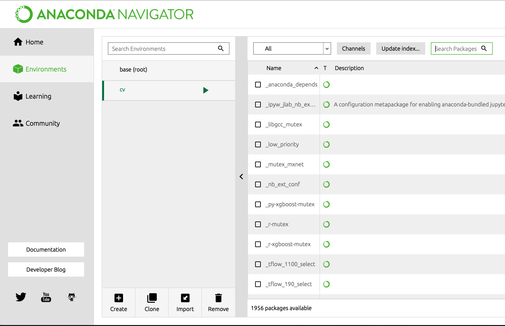
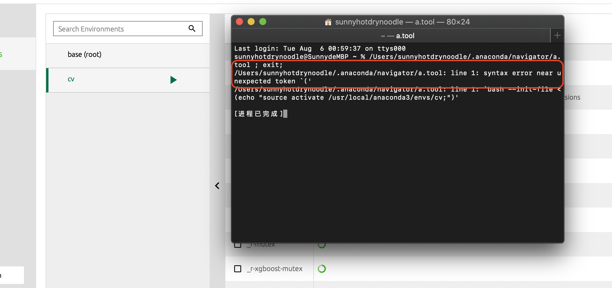
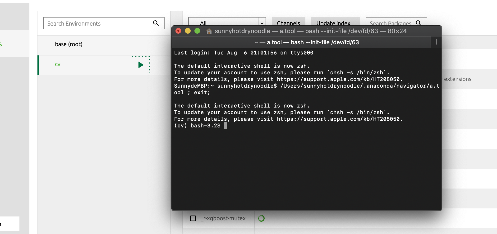

# Mac上配置 Pycharm+Anaconda+OpenCV4+pytorch

+ 整体的环境（OpenCV4+numpy+pytorch+各种机器学习的库）用Anaconda打包、封装好，在创建项目时，直接在Pycharm选定配制好的Anaconda环境。




## 安装Anaconda

+ 打开终端，在homebrew中安装Anaconda

```
brew cask install anaconda
```
+ 安装完成后记得配置anaconda的环境变量,终端输入：

```
echo ‘export PATH=/usr/local/anaconda3/bin:$PATH’ >> ~/.bash_profile
```
+ 通过 `source ~/.bash_profile `使文件生效
+ 系统使用两种Shell: **zsh**和**bash**，终端可以切换：

```
chsh -s /bin/bash
chsh -s /bin/zsh
```
在使用zsh时，Anaconda存在bug，不能由终端进入其配置好的环境,如下图所示：

这里，利用上面的指令将**Shell**切换成**bash**，可顺利进入配好的环境：
## 安装OpenCV4
Anaconda里的opencv版本为3.4，若要安装更高配置的opencv需要在Anaconda中配置好的pip中安装（**pip、numpy等在anaconda图形化界面中很容易安装**），操作如下：
+ 如上图所示，进入到anaconda的打包好的目标环境(此处为cv)中后，

```
pip install opencv-python 
```
+ **<font color=#DC143C><font color=#DC143C>注</font></font>：**虽然，可以在系统级别上安装完整的opencv库，然后在anaconda的中的`/usr/local/anaconda3/envs/cv/lib/python3.7/site-packages`路径中通过添加so文件的方式，将系统中的opencv库链接进anaconda下的python3中，在pycharm中可以通过编译，能正常运行；但是该方法链接的是so库，编程过程中不能通过ide参考源码、没有补全、代提示等。

## 安装pytorch
+ **pytorch**官网上两种安装方式
    
    + **pip**安装 
+ **Anaconda**安装 
    
    官网的安装连接如下：
+ [PyTorch安装官方链接](https://pytorch.org/get-started/locally/)

    在实际操作过程中，采用**Anaconda**安装，指令为：
`
conda install pytorch torchvision -c pytorch`
**安装的过程中，存在某些安装包安装不上的问题**，转而我利用**Anaconda**下的**pip**进行安装。
+ 跟**OpenCV**的安装方法类似，在anaconda图像化界面中进入到选定环境的终端中,也可以在终端中直接打开：

```Shell
SunnydeMBP:~ sunnyhotdrynoodle$ conda info --env
WARNING: The conda.compat module is deprecated and will be removed in a future release.
# conda environments:
#
base                  *  /usr/local/anaconda3
cv                       /usr/local/anaconda3/envs/cv

SunnydeMBP:~ sunnyhotdrynoodle$ source activate
(base) SunnydeMBP:~ sunnyhotdrynoodle$ conda activate cv
(cv) SunnydeMBP:~ sunnyhotdrynoodle$ 
```
+ 进入到anaconda的打包好的目标环境(此处为cv)中后，运行`pip install torch torchvision`**<font color=#DC143C><font color=#DC143C>注</font></font>**:我当前的Anaconda默认用python3.7
+ 若在终端下载速度很慢，可将链接copy出来在浏览器中下载，下载好的`.whl`文件；然后在特定环境的终端中运行如下命令即可（**<font color=#DC143C><font color=#DC143C>注</font></font>：**式中的`.whl`文件，为下载好的torch文件，操作时以实际下载为准）。

```Shell
pip install torch-1.1.0.post2-cp37-none-macosx_10_7_x86_64.whl
```
+ 最后，在安装完pytorch后新建测试`.py`文件,测试代码如下：

```python
from __future__ import print_function
import torch
x = torch.rand(5, 3)
print(x)
print(torch.cuda.is_available())
```
+ 打印结果如下：

```
tensor([[9.9812e-01, 9.2039e-01, 6.3578e-01],
        [1.5449e-01, 1.6484e-01, 7.3462e-01],
        [1.5953e-01, 9.9429e-01, 9.8330e-02],
        [5.1123e-01, 3.8225e-01, 7.8983e-01],
        [8.7435e-02, 1.2934e-04, 4.2169e-01]])
False
```
